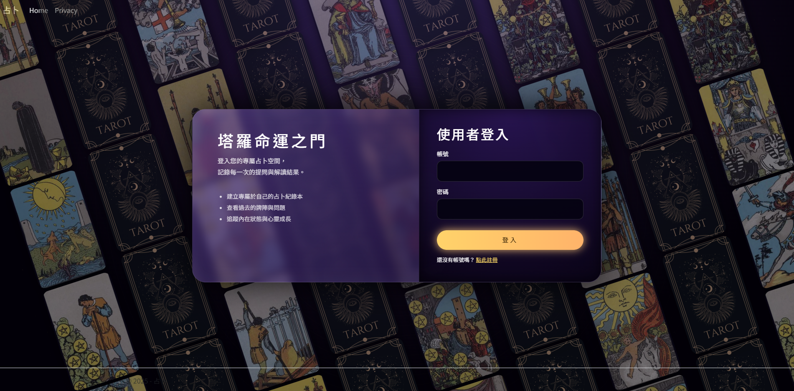
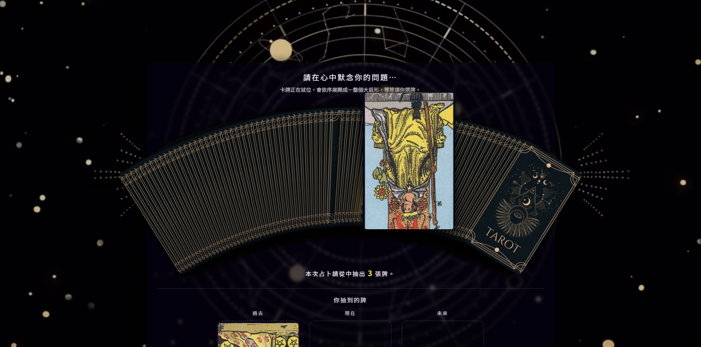
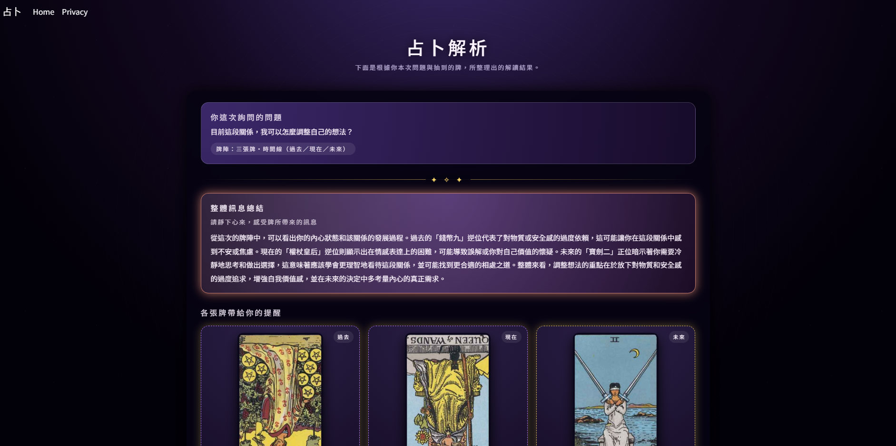

# 🌌 StarWhisper Tarot – AI Powered Divination System

StarWhisper Tarot is an AI-powered tarot divination web application combining
mystical starry UI design with real-time OpenAI-based card interpretation.

## ✨ Features
- Tarot card draw & spread system
- AI tarot interpretation
- Animated starry magical UI
- User history records
- Cloud-ready Azure deployment

## 🛠 Tech Stack
- ASP.NET MVC (.NET 8)
- SQL Server / Azure SQL
- OpenAI API
- HTML / CSS / JavaScript
- Azure Web App

## 🚀 Setup
1. Clone repository  
2. Copy `appsettings.sample.json` → `appsettings.json`  
3. Set your OpenAI API key & DB connection  
4. Run in Visual Studio  

## 📸 Screenshots

